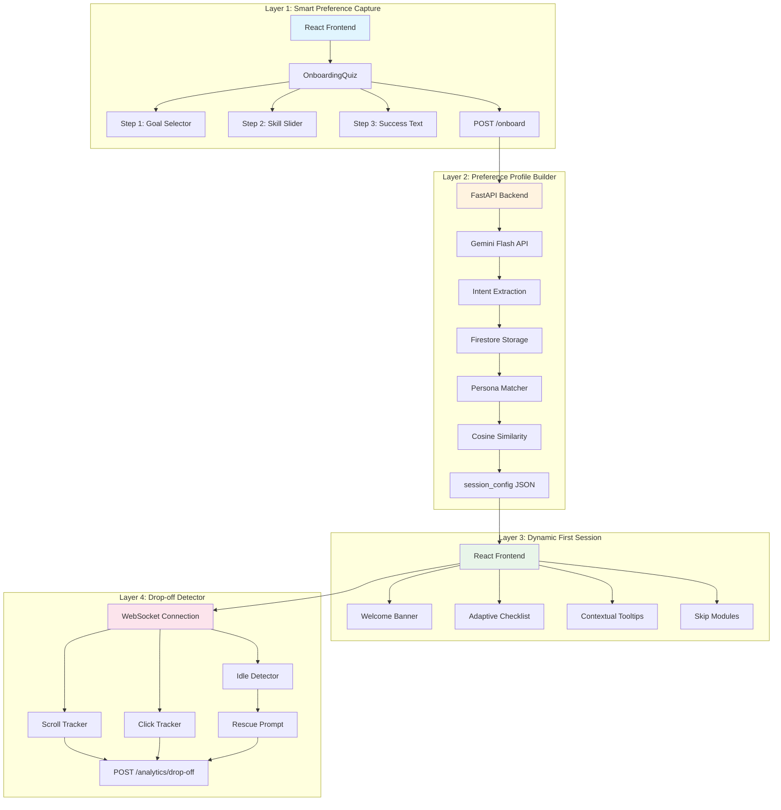
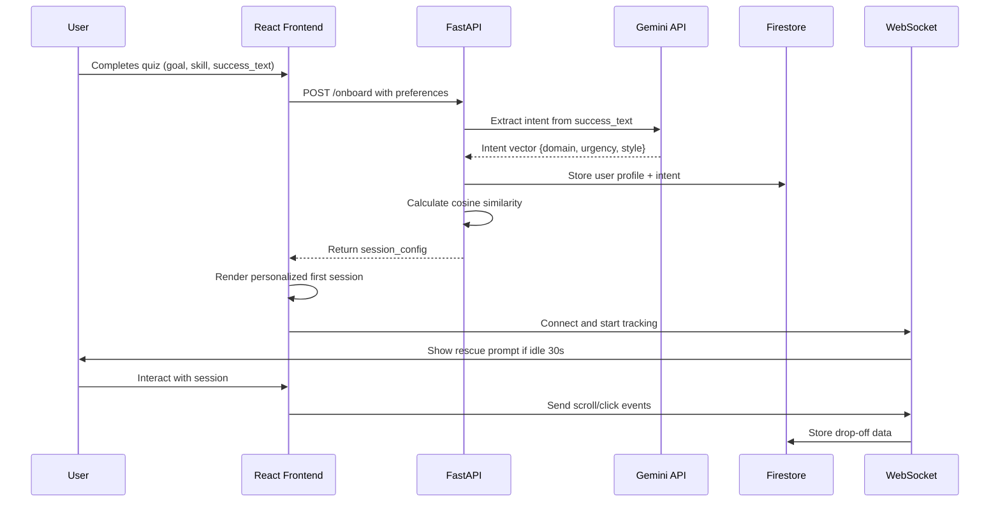

# Intent-First Onboarding Engine - Architectural Plan

## 1. Folder Structure Confirmation

The proposed folder structure matches the specification. Here's the confirmed structure:

```
intent-onboarding/
├── frontend/                    # React + Vite app
│   ├── src/
│   │   ├── components/
│   │   │   ├── OnboardingQuiz/  # Steps 1, 2, 3 components
│   │   │   │   ├── GoalSelector.tsx
│   │   │   │   ├── SkillSlider.tsx
│   │   │   │   └── SuccessText.tsx
│   │   │   ├── FirstSession/    # Welcome banner, checklist, tooltips
│   │   │   │   ├── WelcomeBanner.tsx
│   │   │   │   ├── AdaptiveChecklist.tsx
│   │   │   │   └── ContextualTooltips.tsx
│   │   │   └── Analytics/       # WebSocket tracker, idle detector
│   │   │       ├── WebSocketTracker.tsx
│   │   │       └── IdleDetector.tsx
│   │   ├── hooks/               # Custom React hooks
│   │   │   ├── useIdleDetector.ts
│   │   │   ├── useWebSocket.ts
│   │   │   └── usePersona.ts
│   │   ├── pages/               # Page components
│   │   │   ├── Signup.tsx
│   │   │   └── Dashboard.tsx
│   │   ├── utils/               # Utility functions
│   │   │   └── sessionConfigParser.ts
│   │   ├── App.tsx
│   │   └── main.tsx
│   ├── index.html
│   ├── package.json
│   ├── vite.config.ts
│   ├── tailwind.config.js
│   └── tsconfig.json
├── backend/                     # FastAPI app
│   ├── main.py                  # FastAPI application entry point
│   ├── routers/
│   │   ├── onboard.py           # POST /onboard endpoint
│   │   └── analytics.py         # POST /analytics/drop-off, GET /analytics/summary
│   ├── services/
│   │   ├── gemini_nlp.py        # Gemini Flash intent extraction
│   │   ├── persona_matcher.py   # cosine similarity + persona library
│   │   └── firestore_client.py  # Firestore CRUD operations
│   ├── models/                  # Pydantic schemas
│   │   ├── __init__.py
│   │   ├── request.py           # Request models
│   │   └── response.py          # Response models
│   ├── data/
│   │   └── personas.json        # 7 persona archetypes with feature vectors
│   ├── scheduler.py             # Weekly persona weight update job
│   ├── requirements.txt
│   └── .env
├── .env.example
├── docker-compose.yml
├── README.md
└── plans/
    └── plan.md                  # This document
```

---

## 2. API Endpoints with Request/Response Schemas

### 2.1 POST /onboard — User Onboarding Endpoint

**Purpose:** Capture user preferences and generate personalized session config

**Request:**
```typescript
interface OnboardRequest {
  goal: "learn" | "build" | "explore" | "collaborate";
  skill_level: 1 | 2 | 3 | 4 | 5;  // 1=Beginner, 5=Expert
  success_text: string;             // Open-text response
  device: "mobile" | "tablet" | "desktop";
  referral_source: string;          // UTM source or "direct"
}
```

**Headers:**
- `X-Device-Type`: Device type from frontend
- `X-UTM-Source`: UTM source from URL params
- `X-UTM-Campaign`: UTM campaign from URL params

**Response:**
```typescript
interface OnboardResponse {
  persona: string;                  // e.g., "hands-on-builder"
  highlight_features: string[];     // e.g., ["feature_A", "feature_C"]
  content_tone: "technical" | "friendly" | "minimal" | "detailed";
  first_task: string;               // e.g., "create_project"
  skip_modules: string[];           // e.g., ["marketing_intro"]
  session_id: string;               // UUID for tracking
  user_id: string;                  // Firestore document ID
}
```

**Error Responses:**
- 400: Invalid request body
- 422: Validation error
- 500: Gemini API or Firestore error

---

### 2.2 POST /analytics/drop-off — Track Drop-off Events

**Purpose:** Store user drop-off and engagement data

**Request:**
```typescript
interface DropOffRequest {
  session_id: string;
  user_id: string;
  event_type: "scroll" | "click" | "idle" | "exit" | "complete";
  step?: number;                    // Quiz step (1-3) or session step
  scroll_depth?: number;            // 0-100 percentage
  time_on_step?: number;            // Seconds
  element_id?: string;              // UI element interacted with
  idle_duration?: number;           // Seconds idle before event
  rescue_action?: string;           // "switch_persona" | "skip" | "continue"
}
```

**Response:**
```typescript
interface DropOffResponse {
  status: "recorded";
  session_id: string;
}
```

---

### 2.3 GET /analytics/summary — Analytics Dashboard Data

**Purpose:** Retrieve aggregated analytics for admin dashboard

**Query Parameters:**
- `start_date`: ISO date string (optional)
- `end_date`: ISO date string (optional)
- `persona_filter`: string (optional)

**Response:**
```typescript
interface AnalyticsSummary {
  total_users: number;
  completion_rate: number;
  drop_off_points: {
    step: number;
    count: number;
    percentage: number;
  }[];
  persona_distribution: {
    persona: string;
    count: number;
    percentage: number;
  }[];
  average_session_duration: number;
  rescue_prompts_shown: number;
  rescue_conversion_rate: number;
}
```

---

### 2.4 WebSocket /ws/analytics — Real-time Event Stream

**Purpose:** Real-time tracking of user behavior during first session

**Client → Server Messages:**
```typescript
type WSClientMessage =
  | { type: "scroll"; depth: number; timestamp: number }
  | { type: "click"; element: string; timestamp: number }
  | { type: "step_enter"; step: number; timestamp: number }
  | { type: "step_exit"; step: number; duration: number; timestamp: number }
  | { type: "idle_start"; timestamp: number }
  | { type: "idle_end"; duration: number; timestamp: number };
```

**Server → Client Messages:**
```typescript
type WSServerMessage =
  | { type: "ack"; event_id: string }
  | { type: "rescue_prompt"; message: string; options: RescueOption[] };

type RescueOption = {
  action: "switch_persona" | "skip_module" | "simplify";
  label: string;
  payload: object;
};
```

---

## 3. Persona Archetypes & Feature Vectors

### Feature Vector Schema

Each persona has a 12-dimensional feature vector:
```
[technical_depth, hands_on, guided_learning, community_focus, 
 speed_focus, depth_focus, marketing_interest, collaboration_interest,
 exploration_interest, building_interest, learning_interest, urgency_level]
```

All values normalized to 0.0 - 1.0

---

### Persona 1: Hands-On Builder
```json
{
  "id": "hands-on-builder",
  "name": "Hands-On Builder",
  "description": "Wants to create something tangible immediately",
  "vector": [0.9, 1.0, 0.2, 0.3, 0.8, 0.7, 0.2, 0.3, 0.3, 1.0, 0.4, 0.7],
  "highlight_features": ["code_editor", "project_templates", "deployment"],
  "content_tone": "technical",
  "first_task": "create_project",
  "skip_modules": ["marketing_intro", "community_tour"]
}
```

### Persona 2: Curious Explorer
```json
{
  "id": "curious-explorer",
  "name": "Curious Explorer",
  "description": "Wants to understand the product before committing",
  "vector": [0.4, 0.3, 0.6, 0.4, 0.3, 0.5, 0.3, 0.4, 1.0, 0.4, 0.8, 0.3],
  "highlight_features": ["feature_tour", "documentation", "examples"],
  "content_tone": "friendly",
  "first_task": "explore_features",
  "skip_modules": ["quick_start"]
}
```

### Persona 3: Serious Learner
```json
{
  "id": "serious-learner",
  "name": "Serious Learner",
  "description": "Wants comprehensive education and structured path",
  "vector": [0.7, 0.5, 0.9, 0.5, 0.4, 0.8, 0.4, 0.3, 0.5, 0.5, 1.0, 0.5],
  "highlight_features": ["courses", "certifications", "learning_paths"],
  "content_tone": "detailed",
  "first_task": "start_learning_path",
  "skip_modules": ["quick_start", "templates"]
}
```

### Persona 4: Team Collaborator
```json
{
  "id": "team-collaborator",
  "name": "Team Collaborator",
  "description": "Looking to collaborate with team members",
  "vector": [0.5, 0.4, 0.5, 1.0, 0.4, 0.4, 0.5, 1.0, 0.4, 0.5, 0.5, 0.4],
  "highlight_features": ["team_workspace", "shared_projects", "comments"],
  "content_tone": "friendly",
  "first_task": "invite_team",
  "skip_modules": ["solo_tutorial"]
}
```

### Persona 5: Business Pro
```json
{
  "id": "business-pro",
  "name": "Business Pro",
  "description": "Needs ROI and business outcomes quickly",
  "vector": [0.6, 0.6, 0.3, 0.4, 0.9, 0.5, 0.9, 0.4, 0.3, 0.6, 0.3, 0.9],
  "highlight_features": ["analytics_dashboard", "integrations", "templates"],
  "content_tone": "minimal",
  "first_task": "setup_business_profile",
  "skip_modules": ["tutorials", "community"]
}
```

### Persona 6: Minimalist Quick-Start
```json
{
  "id": "minimalist-quick-start",
  "name": "Minimalist Quick-Start",
  "description": "Wants the fastest path to value with minimal friction",
  "vector": [0.3, 0.7, 0.2, 0.2, 1.0, 0.2, 0.2, 0.2, 0.3, 0.7, 0.3, 0.8],
  "highlight_features": ["quick_actions", "one_click_setup", "getting_started"],
  "content_tone": "minimal",
  "first_task": "quick_setup",
  "skip_modules": ["advanced_features", "tutorials", "community"]
}
```

### Persona 7: Deep Diver
```json
{
  "id": "deep-diver",
  "name": "Deep Diver",
  "description": "Wants to understand the full technical depth",
  "vector": [1.0, 0.6, 0.4, 0.3, 0.3, 1.0, 0.4, 0.3, 0.6, 0.7, 0.6, 0.4],
  "highlight_features": ["api_docs", "advanced_settings", "customization"],
  "content_tone": "technical",
  "first_task": "read_documentation",
  "skip_modules": ["quick_start", "wizards"]
}
```

---

## 4. Gemini Prompt Template for Intent Extraction

### System Prompt
```
You are an intent extraction engine for a personalized onboarding system.
Your task is to analyze user-provided text and extract structured intent signals.
```

### User Prompt Template
```python
INTENT_EXTRACTION_PROMPT = """
Analyze the following user response and extract intent signals.

User's goal: {goal}
User's skill level: {skill_level}/5
User's success description: {success_text}

Extract the following intent signals as a JSON object:

1. domain: The primary domain of interest (e.g., "development", "marketing", "design", "data", "business")
2. urgency: How quickly they want to see results (0.0-1.0, where 1.0 is "now")
3. style: Preferred learning/interaction style ("hands-on", "guided", "self-paced", "collaborative")
4. depth: How much detail they want (0.0-1.0, where 1.0 is "comprehensive")
5. collaboration: Interest in team features (0.0-1.0)
6. exploration: Interest in discovering features (0.0-1.0)
7. primary_motivation: One-line summary of their main motivation

Respond ONLY with valid JSON, no additional text.

Response format:
{{
  "domain": "string",
  "urgency": 0.0-1.0,
  "style": "hands-on|guided|self-paced|collaborative",
  "depth": 0.0-1.0,
  "collaboration": 0.0-1.0,
  "exploration": 0.0-1.0,
  "primary_motivation": "string"
}}
"""
```

### Intent Vector Construction
The extracted intent is converted to a 12-dimensional vector:
```
[depth, hands_on, guided_learning, collaboration, speed_focus, depth_focus,
 marketing_interest, collaboration_interest, exploration_interest,
 building_interest, learning_interest, urgency]
```

Mapping logic:
- `hands_on` = 1.0 if style == "hands-on" else 0.3
- `guided_learning` = 1.0 if style == "guided" else 0.3
- `collaboration_interest` = collaboration value from Gemini
- `exploration_interest` = exploration value from Gemini
- `urgency` = urgency value from Gemini
- `depth_focus` = depth value from Gemini

---

## 5. Environment Variables

### Frontend (.env)
```env
# Vite/React
VITE_API_URL=http://localhost:8000
VITE_WS_URL=ws://localhost:8000/ws/analytics

# Analytics (optional)
VITE_GA_MEASUREMENT_ID=
```

### Backend (.env)
```env
# FastAPI
HOST=0.0.0.0
PORT=8000
DEBUG=true

# Google Gemini API
GEMINI_API_KEY=your_gemini_api_key_here
GEMINI_MODEL=gemini-1.5-flash

# Google Firestore
GCP_PROJECT_ID=your_project_id
GCP_PRIVATE_KEY=your_private_key
GCP_CLIENT_EMAIL=your_client_email

# Firebase Admin (alternative)
FIREBASE_ADMIN_JSON_PATH=./firebase-admin.json

# CORS
CORS_ORIGINS=http://localhost:5173,https://your-vercel-app.vercel.app

# WebSocket
WS_HEARTBEAT_INTERVAL=30
```

### Docker Compose
```yaml
services:
  frontend:
    build: ./frontend
    ports:
      - "5173:5173"
    env_file:
      - ./frontend/.env

  backend:
    build: ./backend
    ports:
      - "8000:8000"
    env_file:
      - ./backend/.env
    volumes:
      - ./backend:/app
```

---

## 6. Potential Failure Points & Mitigation Strategies

### 6.1 Gemini API Failures
| Risk | Impact | Mitigation |
|------|--------|------------|
| API rate limit exceeded | Onboarding fails | Implement retry with exponential backoff (3 attempts) |
| API timeout | Slow response | 10-second timeout, fallback to rule-based extraction |
| Invalid API key | Complete failure | Validate key on startup, show clear error message |
| Response parsing fails | Cannot extract intent | Use Pydantic validation with fallback defaults |

**Fallback Logic:**
```python
def extract_intent_fallback(goal: str, skill_level: int, success_text: str) -> dict:
    """Rule-based fallback when Gemini fails"""
    return {
        "domain": "development" if goal == "build" else "general",
        "urgency": 0.5,
        "style": "hands-on" if goal == "build" else "self-paced",
        "depth": skill_level / 5.0,
        "collaboration": 0.3 if goal == "collaborate" else 0.2,
        "exploration": 0.5 if goal == "explore" else 0.3,
        "primary_motivation": success_text[:50] if success_text else "User onboarding"
    }
```

### 6.2 Firestore Failures
| Risk | Impact | Mitigation |
|------|--------|------------|
| Connection timeout | Data not saved | Retry 3 times, queue for later sync |
| Permission denied | Cannot write | Use service account with minimal permissions |
| Quota exceeded | Writes fail | Implement batch writes, monitor quotas |
| Cold start latency | Slow first request | Keep-alive connection, pre-warm on startup |

### 6.3 Frontend Failures
| Risk | Impact | Mitigation |
|------|--------|------------|
| WebSocket disconnect | No real-time tracking | Auto-reconnect with exponential backoff |
| Quiz step lost on refresh | User loses progress | Persist to localStorage, restore on load |
| Slow animations | Poor UX | Use CSS transforms, reduce motion detection |
| Mobile viewport issues | Broken layout | Responsive breakpoints, touch-friendly targets |

### 6.4 Analytics Failures
| Risk | Impact | Mitigation |
|------|--------|------------|
| Idle detection false positives | Annoying rescue prompts | Require 30s idle + no mouse movement |
| Scroll depth inaccurate | Wrong drop-off data | Use IntersectionObserver, debounce events |
| Session ID mismatch | Cannot track user | Generate UUID on first load, persist in cookie |

### 6.5 Persona Matching Failures
| Risk | Impact | Mitigation |
|------|--------|------------|
| Cosine similarity returns NaN | No persona match | Handle edge cases, default to "curious-explorer" |
| All personas have low similarity | Poor match quality | Use threshold (min 0.3 similarity), fallback to default |
| Feature vector dimension mismatch | Calculation error | Validate vectors on load, normalize all vectors |

---

## 7. System Architecture Diagram



---

## 8. Data Flow Sequence



---

## 9. Implementation Priority

1. **Phase 1: Core Onboarding Flow**
   - Frontend quiz components (Steps 1-3)
   - POST /onboard endpoint
   - Gemini intent extraction
   - Firestore storage
   - Basic session config response

2. **Phase 2: Persona Matching**
   - Persona library with 7 archetypes
   - Cosine similarity implementation
   - session_config generation

3. **Phase 3: Dynamic First Session**
   - Welcome banner rendering
   - Feature highlighting
   - Skip modules logic

4. **Phase 4: Analytics & Drop-off**
   - WebSocket connection
   - Event tracking
   - Idle detection
   - Rescue prompts

5. **Phase 5: Optimization**
   - Weekly persona weight recalibration
   - Analytics dashboard
   - Performance tuning
